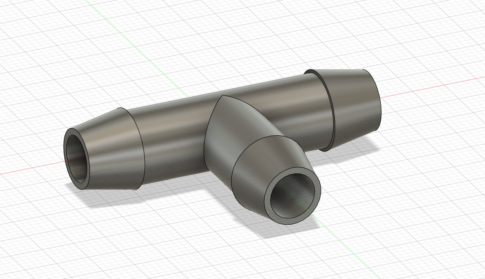
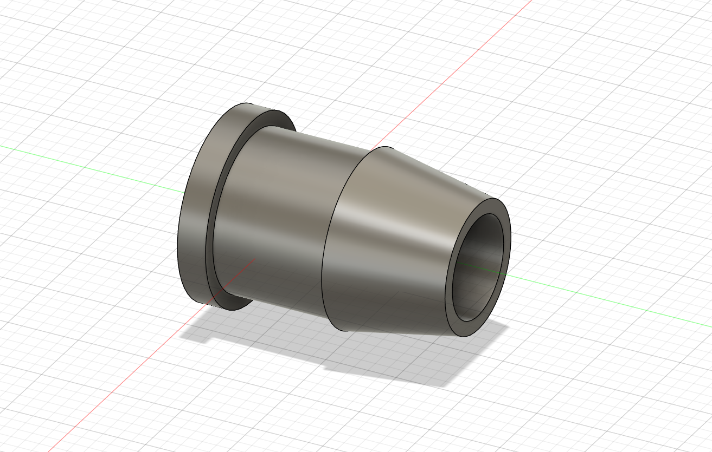
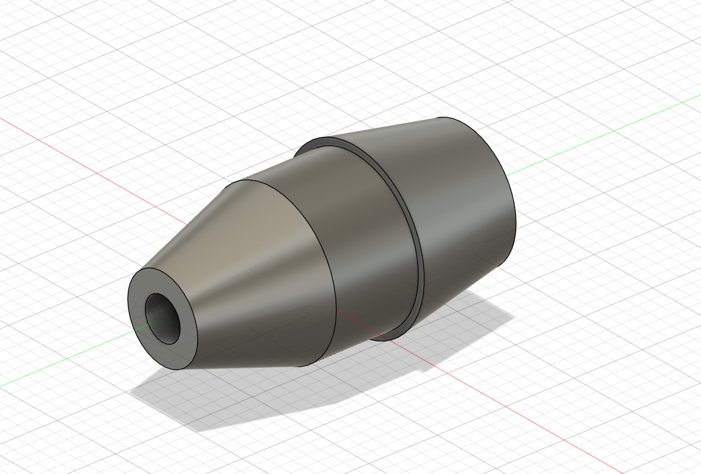
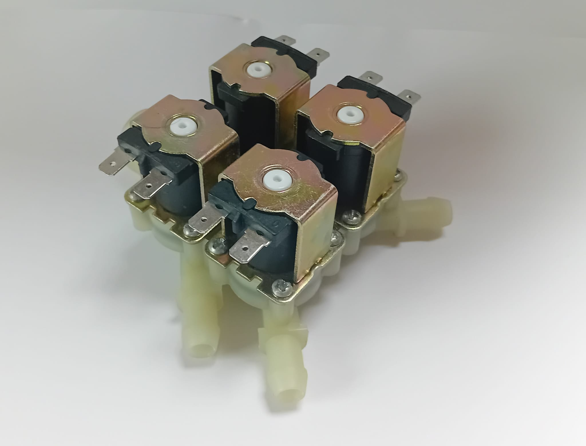

# irrigation system

This directory contains all the things you need for building my or your suctom tubing system for the irrigation.

All parts you need to 3D print are inside the **3D parts - tubing parts** folder.

  
  
  

## my system

Inside the **tubing planing** folder.

My system uses a special four in one solanoid with a gardenhose connection on the one side and four outputs for 10mm tubing.

As you might have guessed my system has four different zones (also beacuse of the four sensors for soil moisture)

