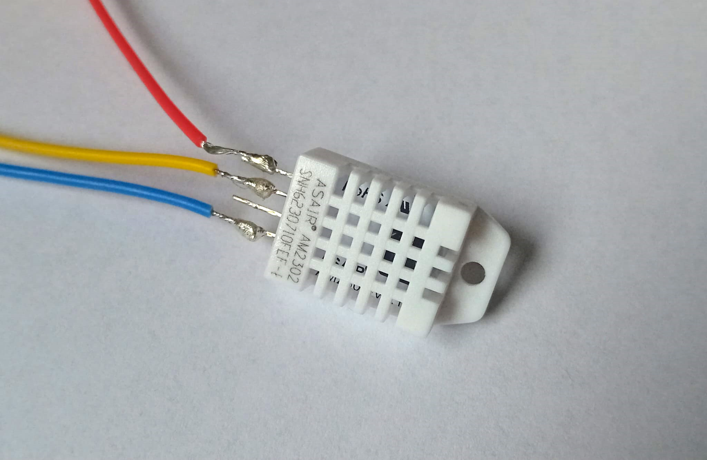

# DHT22 sensor module

| part name       | amount     | price          |   | things you need |
| --------------- | ---------- | -------------- | - |---------------- |
| DHT22           | 1          | ~0.94 USD      | https://de.aliexpress.com/item/1005006963999579.html?spm=a2g0o.productlist.main.8.4fe01vBx1vBxc6&aem_p4p_detail=202506230828074971261634829080000442240&algo_pvid=fcda431a-64bc-4580-a176-f59294651d79&pdp_ext_f=%7B%22order%22%3A%2248%22%2C%22eval%22%3A%221%22%7D&utparam-url=scene%3Asearch%7Cquery_from%3A&search_p4p_id=202506230828074971261634829080000442240_2  | ---             |
| M3 screws 10mm  | 2          | ~              |   | ---             |
| M3 nuts         | 2          | ~              |   | ---             |
| some wire       | 1          | ~              |   | ---             |

[for screws and nuts have a visit you local hardware store or buy them in a larger pack]

The DHT22 is the better version of the DHT11. DHT22 can measure temperatures below zero which is crucial for greenhouse monitoring especially in autum and spring when temperatures can drop below zero. In these cases your Homeassistant instancee will send out a notification so that you have the possibility to react and warm up the greenhouse with a heater or some candels. In the future maybee a heater can also be integrated into Homeassistant by a smart plug or similar.



## housing

Housing is not needed due to the sensor having a M3 screw hole at the top. The sensor will be mounted via a screw on the aluminium extrusions where you need it. Maybee a 3D printed cover for protection agains direct sunlight might me smart in the future.

## ESPHome config

``` yaml
sensor:
  - platform: dht
    pin: GPIO26
    temperature:
      name: temperature_dht22
    humidity:
      name: humidity_dht22
    model: DHT22
    # accuracy_decimals: 1
    update_interval: 60s
```