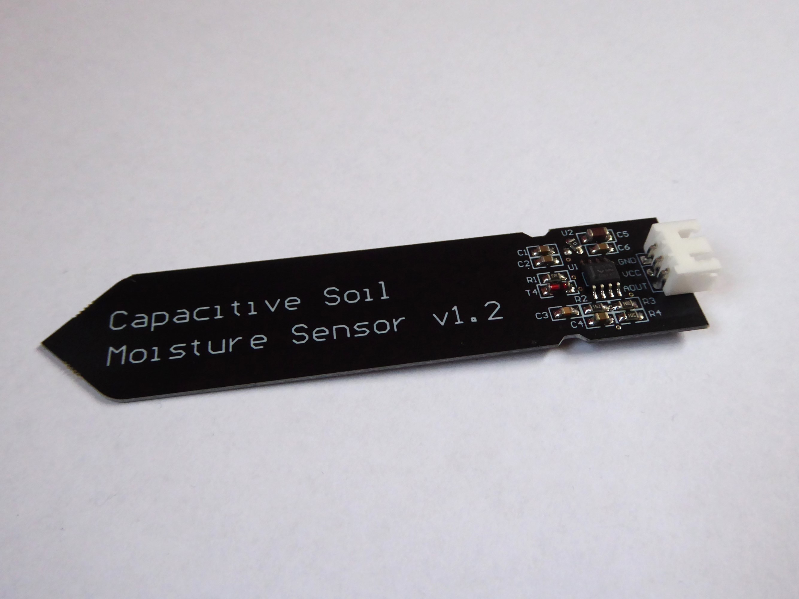

# Capaciative Soil Moisture Sensor sensor module

| part name       | amount     | price          |   | things you need |
| --------------- | ---------- | -------------- | - |---------------- |
| Capaciative Soil Moisture Sensor | 5          | ~2.37 USD (5pcs)      | https://de.aliexpress.com/item/1005005202930632.html?spm=a2g0o.productlist.main.1.48797dceO9blZE&algo_pvid=bb3dd897-6049-4f43-8d40-2504b2c600fa&pdp_ext_f=%7B%22order%22%3A%222164%22%2C%22eval%22%3A%221%22%7D&utparam-url=scene%3Asearch%7Cquery_from%3A  | ---             |
| Shrink tubing 4:1 24mmx1.22 meter | 1          | ~3.08 USD             | https://de.aliexpress.com/item/32812574636.html?spm=a2g0o.productlist.main.1.1d6b2ff5rBIF75&algo_pvid=04fab651-0aed-4642-95ae-c8c0465ccd88&pdp_ext_f=%7B%22order%22%3A%221827%22%2C%22eval%22%3A%221%22%7D&utparam-url=scene%3Asearch%7Cquery_from%3A  | ---             |
| some wire       | 1          | ~              |   | ---             |

Capaciative sensors have one main advantage in ussage they dont deteriorate so they stay fresh for a longer time than sensors with two metal rods. For waterprofing I decided to use shringtubing because 3D prints probably won't make the cut. To furtehr protect the sensors (the top part with some components) from moisture you can use nail polish on top of the components. This is a cheap solution and is also used in the pc overclocking space.




## ESPHome config

Here is the yaml config for four sensors. each sensor has it's own section. The Raw parts are commented out. They are only needed when the Sensors are calibrated. if you do so make the sensor completly dry and write down the value for the wet value take a glass of water and put the sensor inside. make shure not to short any contacts on the pcb.

Bodenfeuchtigkeit is german and translates to soil moisture.

``` yaml
sensor:
  - platform: adc
    pin: GPIO34
    accuracy_decimals: 1
    unit_of_measurement: '%'
    attenuation: auto
    filters: 
      - calibrate_linear: 
        - 2.53 -> 100.0
        - 3.14 -> 0
    name: bodenfeuchtigkeit_1
    update_interval: 60s
  # - platform: adc
  #   pin: GPIO34
  #   accuracy_decimals: 5
  #   attenuation: auto
  #   name: bodenfeuchtigkeit_1_raw
  #   update_interval: 5s
  - platform: adc
    pin: GPIO35
    accuracy_decimals: 1
    unit_of_measurement: '%'
    attenuation: auto
    filters: 
      - calibrate_linear: 
        - 2.53 -> 100.0
        - 3.14 -> 0
    name: bodenfeuchtigkeit_2
    update_interval: 60s
  # - platform: adc
  #   pin: GPIO35
  #   accuracy_decimals: 5
  #   attenuation: auto
  #   name: bodenfeuchtigkeit_1_raw
  #   update_interval: 5s
  - platform: adc
    pin: GPIO32
    accuracy_decimals: 1
    unit_of_measurement: '%'
    attenuation: auto
    filters: 
      - calibrate_linear: 
        - 2.53 -> 100.0
        - 3.14 -> 0
    name: bodenfeuchtigkeit_3
    update_interval: 60s
    # - platform: adc
    #   pin: GPIO35
    #   accuracy_decimals: 5
    #   attenuation: auto
    #   name: bodenfeuchtigkeit_1_raw
    #   update_interval: 5s
  - platform: adc
    pin: GPIO33
    accuracy_decimals: 1
    unit_of_measurement: '%'
    attenuation: auto
    filters: 
      - calibrate_linear: 
        - 2.53 -> 100.0
        - 3.14 -> 0
    name: bodenfeuchtigkeit_4
    update_interval: 60s
    # - platform: adc
    #   pin: GPIO35
    #   accuracy_decimals: 5
    #   attenuation: auto
    #   name: bodenfeuchtigkeit_1_raw
    #   update_interval: 5s
```