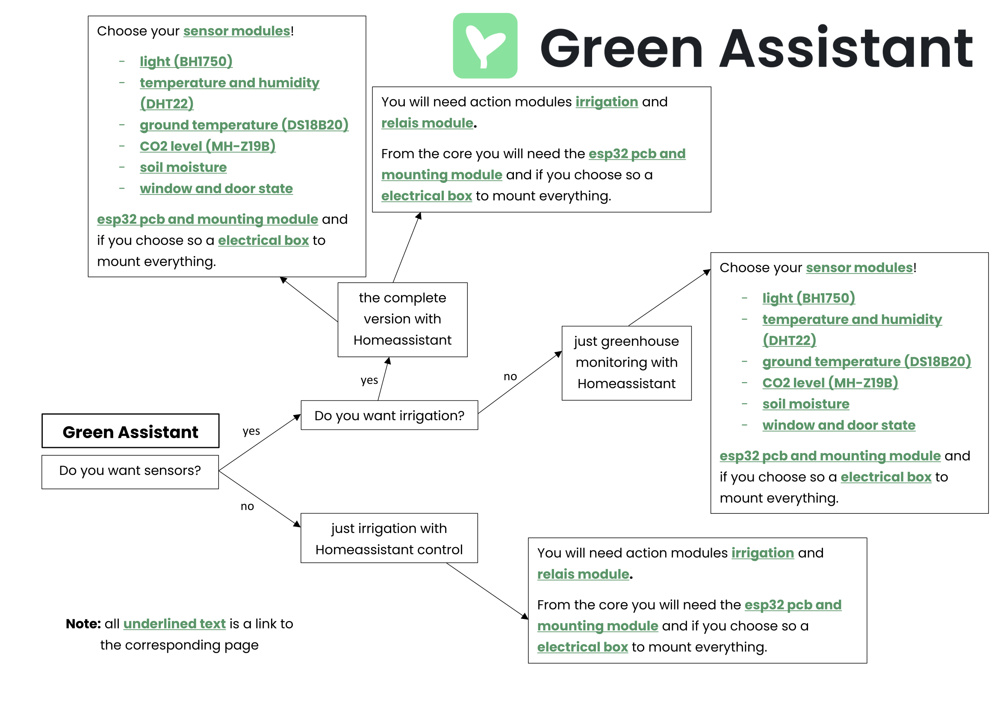

 &nbsp; &nbsp; 

 

    

 

# homeassistant_automaic_greenhouse
A cool Project to make your greenhouse smart. What about automaic irrigation and collecting enviromental data right from your garden.

## About the project
This project actually is sthe second iteration on me trying to automate our greenhouse. The first version relied on an Arduino Uno powered by a 24V powertool battery and sensordata was logged to an SD-card. Since we now have power and wifi connectivity to the greenhouse I wanted to step up the game and build something that is way smarter and will hopefully last forever. If you were wondering this is why an industrial grade electrical box with rails was used.

## The concept of sensor and action modules
This project is a very speced out version of a greenhouse automation and environmental monitoring system. Due to cost or other reasons you might not include all the sensors used by me. To make it easyer to do so each sensor is getting his own folder inside the sensor modules directory. You will find everything you need to know about a so called sensor module inside this folder from CAD files, STL Files for 3D printing and scematics to instructions on sourcing the parts.

A detailed list of all sensors used in the project can be found in the **sensor modules** directory.

Like the sensors you might choose to leave out some action modules aka the parts that actually do something like the relais and solanoids for an irrigation system.

These so called action modules with all their corresponding documentation and files can be found in the **action modules** directory.

## Where to start

If you are completly new to this project you might take a look at the folowing map. Go thrugh the individual questions and build your own Green Assistant. Follow the link below to get to an interactive pdf version. Clicking on the links will be more func than searching in this Repo.

## The project

A list of all uesd parts can be found in the **parts** directory.

All files corresponding to the main part of the project so the electrical box with all the controll electronics can be found in the **core** directory.

### PCB

You will need this PCB to connect all sensors reliably to the ESP32 S3. All unused pins of the ESP also have a connection to a pinheader so you are free to add sensors without needing to modify the PCB. 

PCB Sourcefiles can be found inside [core/esp32 pcb and mounting/pcb files/esp shield](./core/esp32%20pcb%20and%20mounting/pcb%20files/esp_shield/).

  
  

### Wiring

Wehn you have coosen your parts and want to build your Green Assistant have alook at this wiring diagramm of all the sensors.

### Homeassistant Configuration and Dashboards

All stuff regarding Homeassistant can be found in the **homeassistant files** directory. Dashboards will be in a seperate folder.

 

# BOM

**@Hackclub** please note that some parts are abit expensive but I already have them so they are listed here just for reference if somebody wontas to build his own Green Assistant. Go here for a list of parts I seek Hackclub sponsorship for.

**sum: 318.49 USD**

**hopefully paid for by Hackclub :): 81.47 USD**

| part name       | amount     | price | link | note |
| --------------- | ---------- | ----- | ---- | ---  |
| 4 in 1 solanoid 12V DC | 1          | 17.46 USD | https://de.aliexpress.com/item/1005003222372894.html?spm=a2g0o.productlist.main.2.7b883b2805U1oZ&algo_pvid=367fdcb6-b2b8-4472-b90f-06dec834dcc7&pdp_ext_f=%7B%22order%22%3A%2290%22%2C%22eval%22%3A%221%22%7D&utparam-url=scene%3Asearch%7Cquery_from%3A
| 25m tubing 10mm inner diameter       | 1          | 26.92 USD   |https://de.aliexpress.com/item/1005006851012150.html?spm=a2g0o.productlist.main.7.4fc6qemXqemXUn&algo_pvid=38c16ebb-f0d1-407d-8d17-a22a1c15e6e7&pdp_ext_f=%7B%22order%22%3A%224%22%2C%22eval%22%3A%221%22%7D&utparam-url=scene%3Asearch%7Cquery_from%3A|
| Relais modul 4 Way | 1 | 1.19 USD | https://de.aliexpress.com/item/1005002867727977.html?spm=a2g0o.productlist.main.11.13a1dJEvdJEvMc&algo_pvid=4fdea743-d29c-430b-87f1-e4d68f1caa09&pdp_ext_f=%7B%22order%22%3A%222771%22%2C%22eval%22%3A%221%22%7D&utparam-url=scene%3Asearch%7Cquery_from%3A
| Electrical box | 1 | 127.75 USD| https://www.elektro4000.de/Elektroinstallations-Systeme/Installationsverteiler/Leergehaeuse/Eaton-Unterkasten-U-CI44E::55531.html |any box or mounting with DIN Rails will be fine |
| Electrical Box Lid | 1 | 82.50 USD | https://www.elektro4000.de/Installationsmaterial/Verbindungsmaterial/Deckel/Gehaeuse-fuer-Montage-auf-der-Wand/Eaton-CI-Gehaeuse-Deckel-D125-CI44::55551.html
| DIN Rail Powersuply 5V DC Out 15W | 1 | 1.19 USD | https://de.aliexpress.com/item/1005006112378832.html?spm=a2g0o.productlist.main.1.c7272b87z7yuLe&algo_pvid=7effdf59-b7f3-46b6-8a67-f866ad0ae34e&pdp_ext_f=%7B%22order%22%3A%221440%22%2C%22eval%22%3A%221%22%7D&utparam-url=scene%3Asearch%7Cquery_from%3A
| DIN Rail Powersuply 12V DC Out 15W | 1 | 1.19 USD | https://de.aliexpress.com/item/1005006112378832.html?spm=a2g0o.productlist.main.1.c7272b87z7yuLe&algo_pvid=7effdf59-b7f3-46b6-8a67-f866ad0ae34e&pdp_ext_f=%7B%22order%22%3A%221440%22%2C%22eval%22%3A%221%22%7D&utparam-url=scene%3Asearch%7Cquery_from%3A
| ESP32-S3 | 1 | 1.19 USD | https://de.aliexpress.com/item/1005005051294262.html?spm=a2g0o.productlist.main.1.44e77227eWXK8y&algo_pvid=8d3c9e27-0ba9-47e2-ad79-140c2bfeddc5&pdp_ext_f=%7B%22order%22%3A%223124%22%2C%22eval%22%3A%221%22%7D&utparam-url=scene%3Asearch%7Cquery_from%3A | |
| BH1750 Breakout | 1          | ~0.73 USD      | https://de.aliexpress.com/item/1005007347385714.html?spm=a2g0o.productlist.main.6.777f1c59hsCKIx&algo_pvid=ace7ffce-6eb3-4c41-b141-61d0790658f1&pdp_ext_f=%7B%22order%22%3A%223%22%2C%22eval%22%3A%221%22%7D&utparam-url=scene%3Asearch%7Cquery_from%3A&gatewayAdapt=glo2deu  | |
| DHT22           | 1          | ~0.94 USD      | https://de.aliexpress.com/item/1005006963999579.html?spm=a2g0o.productlist.main.8.4fe01vBx1vBxc6&aem_p4p_detail=202506230828074971261634829080000442240&algo_pvid=fcda431a-64bc-4580-a176-f59294651d79&pdp_ext_f=%7B%22order%22%3A%2248%22%2C%22eval%22%3A%221%22%7D&utparam-url=scene%3Asearch%7Cquery_from%3A&search_p4p_id=202506230828074971261634829080000442240_2  | ---             |
| DS18B20 2 meter cable | 1          | ~1.17 USD      | https://de.aliexpress.com/item/1005008024174225.html?spm=a2g0o.productlist.main.2.892a1a0e74KpG7&algo_pvid=fdca3388-9d61-4050-a1fa-ad9c645db0ba&pdp_ext_f=%7B%22order%22%3A%221023%22%2C%22eval%22%3A%221%22%7D&utparam-url=scene%3Asearch%7Cquery_from%3A  | ---             |
| MH-Z19B | 1          | ~21.68 USD      | https://de.aliexpress.com/item/4001296615950.html?spm=a2g0o.productlist.main.1.10df56e9kDzAiu&algo_pvid=496ed4bc-a93e-4799-9a9a-8ecbef09edf5&pdp_ext_f=%7B%22order%22%3A%2296%22%2C%22eval%22%3A%221%22%7D&utparam-url=scene%3Asearch%7Cquery_from%3A  | ---             |
| Capaciative Soil Moisture Sensor | 5          | ~2.37 USD (5pcs)      | https://de.aliexpress.com/item/1005005202930632.html?spm=a2g0o.productlist.main.1.48797dceO9blZE&algo_pvid=bb3dd897-6049-4f43-8d40-2504b2c600fa&pdp_ext_f=%7B%22order%22%3A%222164%22%2C%22eval%22%3A%221%22%7D&utparam-url=scene%3Asearch%7Cquery_from%3A  | ---             |
| Shrink tubing 4:1 24mmx1.22 meter | 1          | ~3.08 USD             | https://de.aliexpress.com/item/32812574636.html?spm=a2g0o.productlist.main.1.1d6b2ff5rBIF75&algo_pvid=04fab651-0aed-4642-95ae-c8c0465ccd88&pdp_ext_f=%7B%22order%22%3A%221827%22%2C%22eval%22%3A%221%22%7D&utparam-url=scene%3Asearch%7Cquery_from%3A  | ---             |
| Reed switch Breackout | 1          | ~0.65 USD (10pcs)      | https://de.aliexpress.com/item/1005008372135180.html?spm=a2g0o.productlist.main.19.4fe959f0QsmFeq&algo_pvid=b2bcd3b2-6353-4def-9e17-8f16d86e7c01&pdp_ext_f=%7B%22order%22%3A%2245%22%2C%22eval%22%3A%221%22%7D&utparam-url=scene%3Asearch%7Cquery_from%3A  | ---             |
| magnet 10x2mm   | 2          | ~2.26 USD (20pcs)              | https://de.aliexpress.com/item/1005009266299777.html?spm=a2g0o.productlist.main.1.73353687XlFb9S&algo_pvid=005b8154-ff95-40c2-aa0e-3425ebdeabd9&pdp_ext_f=%7B%22order%22%3A%2242%22%2C%22eval%22%3A%221%22%7D&utparam-url=scene%3Asearch%7Cquery_from%3A  | ---             |
| PCB (without assembly) | 1 | ~5 USD subject to JLCPCB | | if you choose assembly it will be more expensive but I already have the parts at home |
| M3 screws 10mm  | 8          | ~              |   | ---             |
| M3 screws 15mm  | 2          | ~              |   | ---             |
| M3 nuts         | 10          | ~              |   | ---             |
| -> set of screws and nuts | 1| 1.19 USD | https://de.aliexpress.com/item/1005007273134914.html?spm=a2g0o.productlist.main.7.2cb11b1aQ6xTNZ&algo_pvid=134ed8c9-ae6d-44f4-80cc-761426203be1&pdp_ext_f=%7B%22order%22%3A%22476%22%2C%22eval%22%3A%221%22%7D&utparam-url=scene%3Asearch%7Cquery_from%3A
| some wire (15m)       | 2          | 21.22 USD              | https://de.aliexpress.com/item/1005007371239057.html?spm=a2g0o.productlist.main.8.a56f4f561YvSN9&aem_p4p_detail=2025063002162114202903362944350000136812&algo_pvid=5b7d4cc4-4e18-49cf-aad0-bd6d2e445630&pdp_ext_f=%7B%22order%22%3A%225%22%2C%22eval%22%3A%221%22%7D&utparam-url=scene%3Asearch%7Cquery_from%3A&search_p4p_id=2025063002162114202903362944350000136812_2  | ethernet cable is shielded -> better for analog sensors (especially for longer distances)            |
| t-piece         | 22         | ---   || 3D-printed part |
| nozzle-piece    | 22         | ---   || 3D-printed part |
| end-piece       | 4          | ---   || 3D-printed part |
| Ralais module mounting         | 1         | ---   || 3D-printed part |
| PCB Mounting | 1 | --- || 3D-printed part | 
| BH1750 case top        | 1          | ---            |   | 3D-printed part      |
| BH1750 case bottom     | 1          | ---            |   | 3D-printed part      |
| MH-Z19B case top        | 1          | ---            |   | 3D-printed part      |
| MH-Z19B case bottom     | 1          | ---            |   | 3D-printed part      |
| magnet case top        | 1          | ---            |   | 3D-printed part      |
| magnet case bottom     | 1          | ---            |   | 3D-printed part      |
| reed case top        | 1          | ---            |   | 3D-printed part      |
| reed case bottom     | 1          | ---            |   | 3D-printed part      |

**sum: 318.49 USD**

**hopefully paid for by Hackclub :) : 81.47 USD** 

# LICENSE
This work is licensed under CC BY-NC-SA 4.0. 

To view a copy of this license, visit https://creativecommons.org/licenses/by-nc-sa/4.0/

