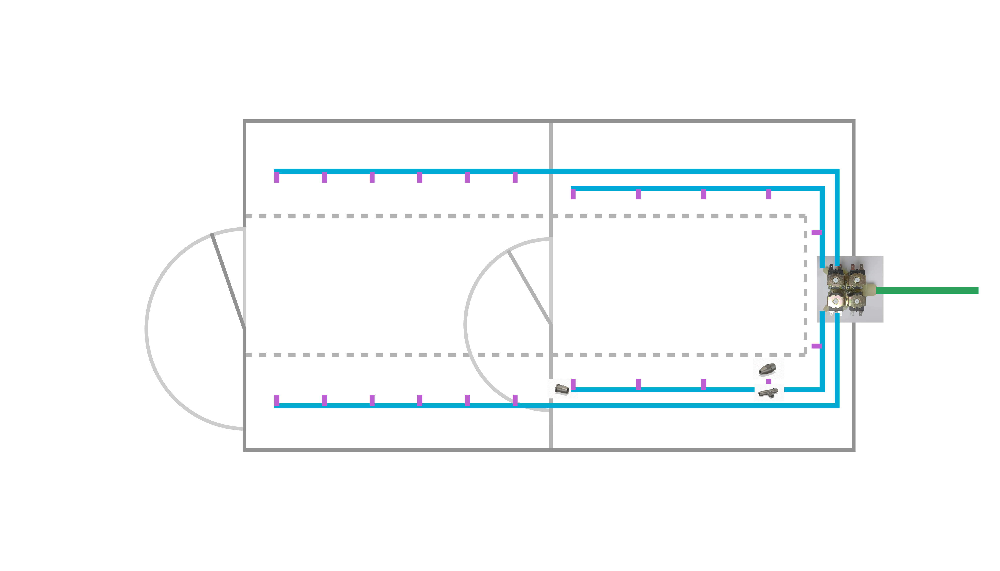

# tubing planing

This folder contains planing for my version of the tubing system yours will probably vary depending on your greenhouse size.

| part name       | amount     | price | link |
| --------------- | ---------- | ----- | ---- |
| 4 in 1 solanoid 12V DC | 1          | 17.46 USD | https://de.aliexpress.com/item/1005003222372894.html?spm=a2g0o.productlist.main.2.7b883b2805U1oZ&algo_pvid=367fdcb6-b2b8-4472-b90f-06dec834dcc7&pdp_ext_f=%7B%22order%22%3A%2290%22%2C%22eval%22%3A%221%22%7D&utparam-url=scene%3Asearch%7Cquery_from%3A
| t-piece         | 22         | ---   | |
| nozzle-piece    | 22         | ---   ||
| end-piece       | 4          | ---   ||
| 25m tubing 10mm inner diameter       | 1          | 26.92 USD   |https://de.aliexpress.com/item/1005006851012150.html?spm=a2g0o.productlist.main.7.4fc6qemXqemXUn&algo_pvid=38c16ebb-f0d1-407d-8d17-a22a1c15e6e7&pdp_ext_f=%7B%22order%22%3A%224%22%2C%22eval%22%3A%221%22%7D&utparam-url=scene%3Asearch%7Cquery_from%3A|

