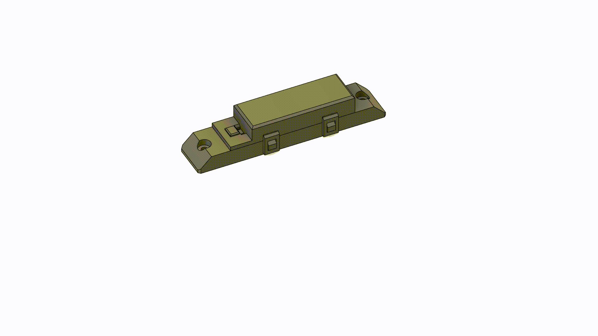

# BH1750 sensor module

| part name       | amount     | price          |   | things you need |
| --------------- | ---------- | -------------- | - |---------------- |
| BH1750 Breakout | 1          | ~0.73 USD      | https://de.aliexpress.com/item/1005007347385714.html?spm=a2g0o.productlist.main.6.777f1c59hsCKIx&algo_pvid=ace7ffce-6eb3-4c41-b141-61d0790658f1&pdp_ext_f=%7B%22order%22%3A%223%22%2C%22eval%22%3A%221%22%7D&utparam-url=scene%3Asearch%7Cquery_from%3A&gatewayAdapt=glo2deu  | ---             |
| M3 screws 15mm  | 2          | ~              |   | ---             |
| M3 nuts         | 2          | ~              |   | ---             |
| some wire       | 1          | ~              |   | ---             |
| case top        | 1          | ---            |   | 3D printer      |
| case bottom     | 1          | ---            |   | 3D printer      |

[for screws and nuts have a visit you local hardware store or buy them in a larger pack]

The BH1750 is used for measuring light intensity in LUX. It is going to be mounted on the top middle rail inside thee grennhouse facing down.



## housing

You will need bot parts of the case and two M3 15mm long screws with nuts compatible with your greenhouses aluminium profiles. 

## 3D printing

The desing works totally fine with my SLA printer and Anycubig tough resin. You might need to think about placing your supports and material choices. The tough resin I use is a bit elastik so the clips dont snap of and can be bend temporarily during assembly.

STL Files are inside this folder.

## ESPHome config

``` yaml
sensor:
  - platform: bh1750
    name: "BH1750 Illuminance"
    address: 0x23
    update_interval: 60s
```