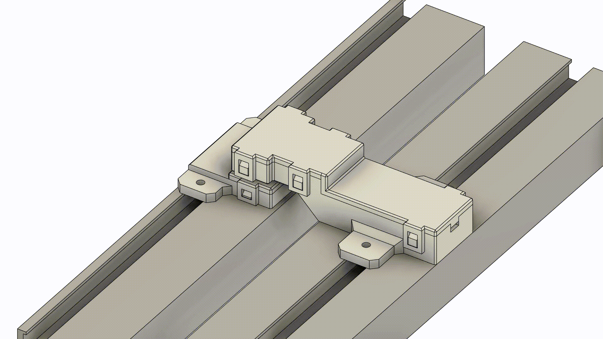

# window contacts

For sensing the state of the windows on the greenhouse reed switches and magnets will be used to build custom window contacts. When integrated in Homeassistant the window will only have two states: **opened/closed**. The contacts are specially designed for my greenhouse so you will probably need to adjust the files to your needs.

| part name       | amount     | price          |   | things you need |
| --------------- | ---------- | -------------- | - |---------------- |
| Reed switch Breackout | 1          | ~0.65 USD (10pcs)      | https://de.aliexpress.com/item/1005008372135180.html?spm=a2g0o.productlist.main.19.4fe959f0QsmFeq&algo_pvid=b2bcd3b2-6353-4def-9e17-8f16d86e7c01&pdp_ext_f=%7B%22order%22%3A%2245%22%2C%22eval%22%3A%221%22%7D&utparam-url=scene%3Asearch%7Cquery_from%3A  | ---             |
| M3 screws 15mm  | 4          | ~              |   | ---             |
| M3 nuts         | 4          | ~              |   | ---             |
| some wire       | 1          | ~              |   | ---             |
| magnet 10x2mm   | 2          | ~2.26 USD (20pcs)              | https://de.aliexpress.com/item/1005009266299777.html?spm=a2g0o.productlist.main.1.73353687XlFb9S&algo_pvid=005b8154-ff95-40c2-aa0e-3425ebdeabd9&pdp_ext_f=%7B%22order%22%3A%2242%22%2C%22eval%22%3A%221%22%7D&utparam-url=scene%3Asearch%7Cquery_from%3A  | ---             |
| magnet case top        | 1          | ---            |   | 3D printer      |
| magnet case bottom     | 1          | ---            |   | 3D printer      |
| reed case top        | 1          | ---            |   | 3D printer      |
| reed case bottom     | 1          | ---            |   | 3D printer      |

[for screws and nuts have a visit you local hardware store or buy them in a larger pack]



## 3D printing

The desing works totally fine with my SLA printer and Anycubig tough resin. You might need to think about placing your supports and material choices. The tough resin I use is a bit elastik so the clips dont snap of and can be bend temporarily during assembly.

STL Files are inside this folder.

## ESPHome config

``` yaml
binary sensor:
  - platform: ...
    name: "window contact"
    device_class: window
    update_interval: 60s
```

for a door sensor:

``` yaml
binary sensor:
  - platform: ...
    name: "door contact"
    device_class: door
    update_interval: 60s
```